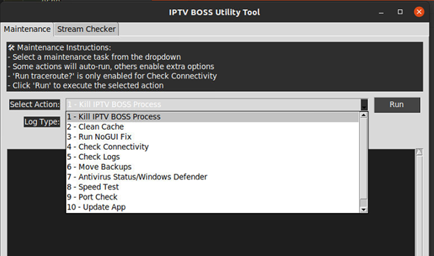
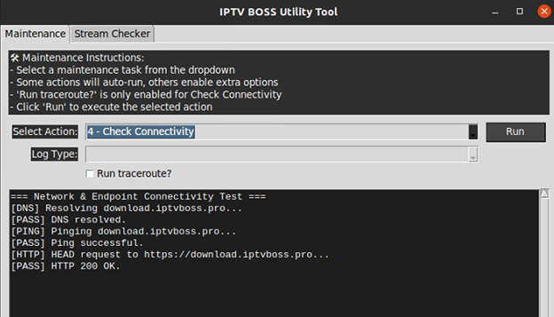
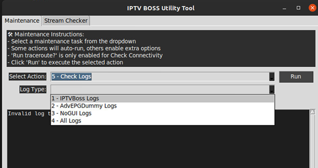
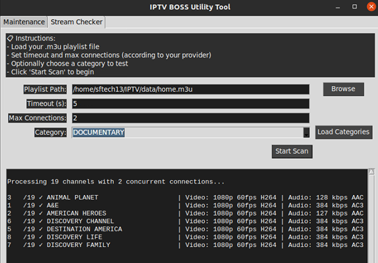

# IPTV BOSS Utility

A cross-platform (Windows & Ubuntu Linux) IPTV playlist checker and maintenance toolkit with a user-friendly GUI.


---

## Features

* **Playlist Checker:** Validate IPTV M3U playlists for working/broken streams, video/audio codec info, resolution, and more.
* **Maintenance Tools:** Kill running app, clean temp/cache, tail logs, move backups, network checks, and more.
* **Simple GUI:** Intuitive interface with tabs for Stream Checker and Maintenance.
* **Cross-platform:** Works on Windows and Linux (Ubuntu).
* **Easy Install:** Download as `.exe` (Windows) or `.deb` (Ubuntu), with all dependencies bundled. No Python required for end users.

---




---


## Quick Start

### Windows

1. Download the latest `.exe` or `.msi` release from [Releases](https://github.com/sftech13/IPTVBOSSUtility/releases).
2. Run the installer and follow prompts.
3. Start **IPTV BOSS Utility** from the Start Menu or Desktop.

### Ubuntu / Linux

1. Download the latest `.deb` from [Releases](https://github.com/sftech13/IPTVBOSSUtility/releases).
2. Install via terminal:

   ```bash
   sudo dpkg -i iptvboss-utility_*.deb
   sudo apt-get install -f  # Only if dependencies are missing
   ```
3. Launch from your application menu or by running:

   ```bash
   iptvboss
   ```

---

## Usage

1. **Open the app.**
2. **Maintenance Tab:** Run maintenance tasks like cleaning cache, process kill, log tail, backups, and connectivity check.
3. **Stream Checker Tab:**

   * Load your `.m3u` playlist file.
   * Set timeout and max concurrent connections.
   * (Optional) Pick a group/category.
   * Click **Start Scan** to begin.
4. **Results** display in the output pane, with working/dead status and stream info.

---

## Building From Source

For developers/contributors.

**Requirements:** Python 3.8+, `pip`, and [cx\_Freeze](https://github.com/marcelotduarte/cx_Freeze).

```bash
git clone https://github.com/sftech13/IPTVBOSSUtility.git
cd IPTV BOSS Utility
pip install -r requirements.txt
python iptv_gui_full.py
```

**To build for distribution:**

* **Windows:** Use cx\_Freeze to create an `.exe`/`.msi` package.
* **Ubuntu:** Use cx\_Freeze for a standalone folder, then package with `fpm` or your preferred `.deb` builder.

**Include all resources:**

* `iptv_quality_core.py`
* `iptv_gui_full.py`
* `linux_functions.sh`
* `win_functions.bat`
* `iptv_icon.png` and `iptv_icon.ico`

> **Note:** You must have `ffmpeg` and `ffprobe` installed and in your system PATH for all features to work.

---

## File Structure

```
.
├── iptv_gui_full.py        # Main GUI app
├── iptv_quality_core.py    # Core stream checker logic
├── linux_functions.sh      # Linux maintenance scripts
├── win_functions.bat       # Windows maintenance scripts
├── requirements.txt
├── iptv_icon.png / .ico    # App icons
└── README.md
```

---

## Credits

Developed by [sftech13](https://github.com/sftech13).
